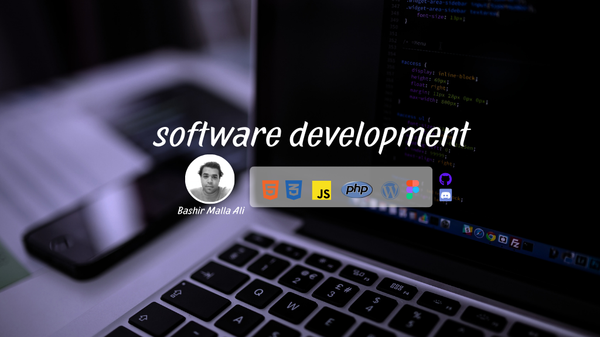

# Laravel Blog Website 
<li>CRUD</li>
<ul>
Create
Read
Update
Delete
</ul>

## Overview
This project is a blog website built using Laravel Blade templates, Tailwind CSS, and PHP. The blog includes various posts categorized under different topics such as Web Development, Mobile App Development, Software Development, and DevOps.


## Features
- **Hero Section**: Welcomes users with a hero section that includes a call to action button to start reading blog posts.
- **Blog Post Cards**: Displays blog posts with titles, descriptions, and thumbnails.
- **Category Tags**: Each post is tagged with a relevant category such as Mobile Apps, Software Development, or DevOps.
- **Dynamic Content**: Blog posts are dynamically loaded from the database and displayed using Laravel's Blade templates.

## Technologies Used
- **Laravel**: For building the backend and managing blog post data.
- **Blade Templates**: For rendering views and layouts.
- **Tailwind CSS**: For styling the UI with a modern and responsive design.
- **PHP**: For server-side logic.
- **MySQL**: For storing blog posts and categories in a database.

## Sections Breakdown
- **Hero Section**: A full-width hero banner with a welcome message and a link to start reading the blog.
- **Card Section**: Displays featured posts with an image, category tag, title, and description for each post.
  - The featured posts include categories like:
    - Web Development Trends
    - Mobile Applications in 2024
    - Innovations in Software Development
    - DevOps Culture
  
## Installation
1. Clone the repository:
   ```bash
   git clone https://github.com/Bma47/laravel-blog.git

<span style="color: #0f9d58">Bashir Malla Ali </span>
